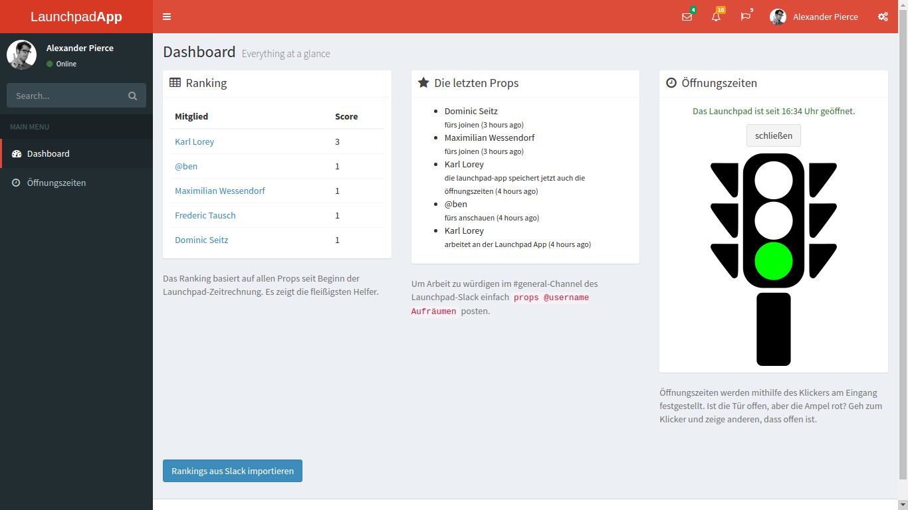

# Launchpad App

This app logs when our coworking space called Launchpad is open/closed. It also reads our slack channel and mimics the behavior of Growbot, i.e. reading `props @user for cleaning up`.

## Installation

* Clone the repo
* Install the dependencies with Composer
* Fill out the .env file (ask [@lorey](https://github.com/lorey) for API keys)
* Run `php artisan migrate`
* Import the first rankings

## Update rankings

Just open http://{your-url}/slack to import the rankings.